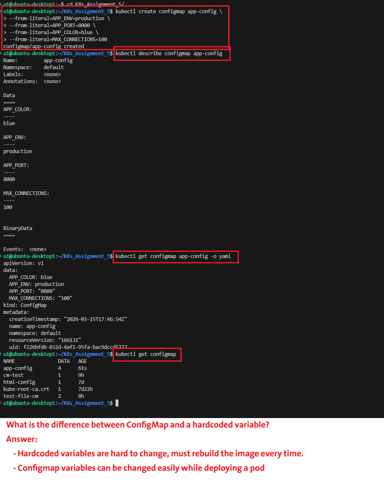
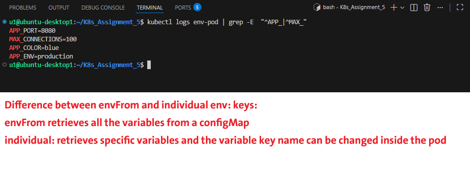
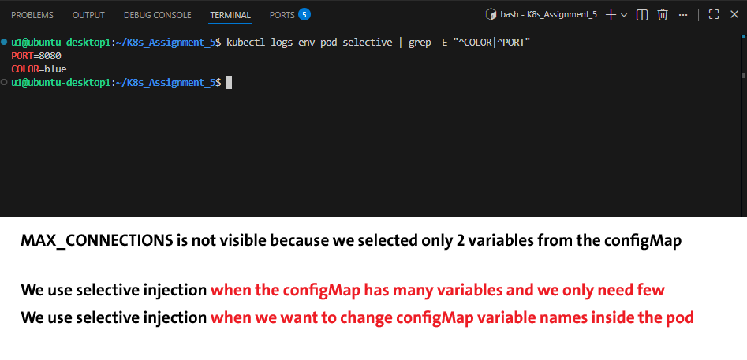
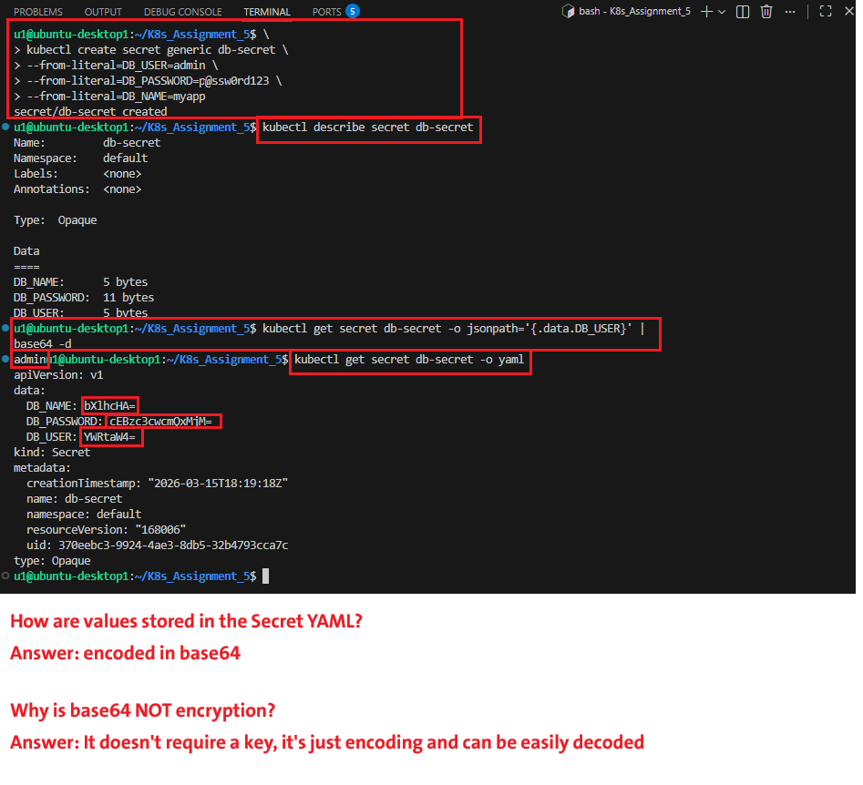
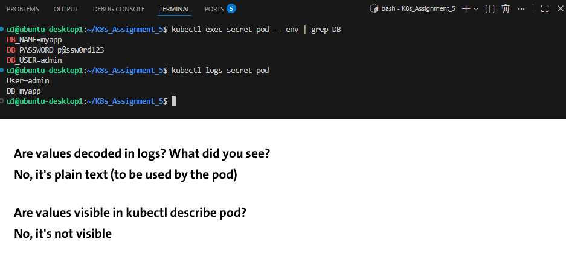
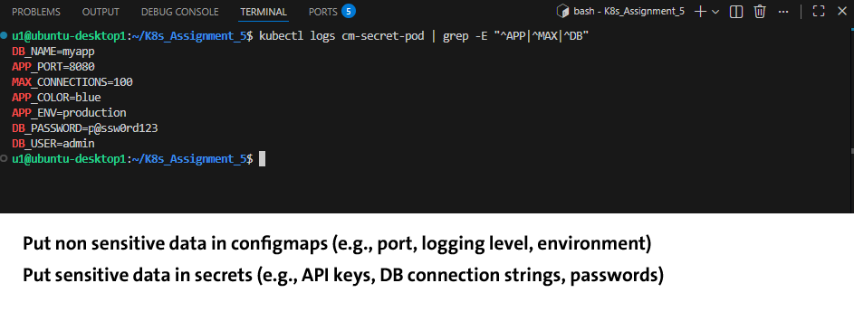
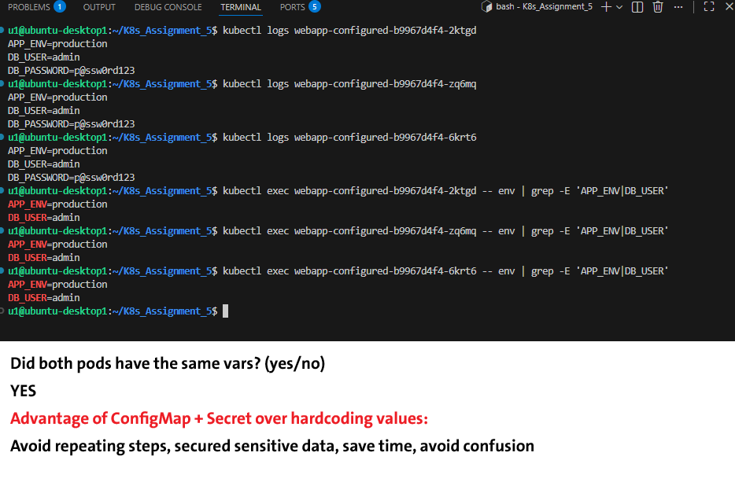

## Task 1: Create a ConfigMap - Imperative

**Objective:** Create a ConfigMap named `app-config` containing four environment-specific keys without using a YAML file.

---

## Task 2: Inject ConfigMap as Environment Variables

**Objective:** Create a Pod named `env-pod` that automatically injects all keys from `app-config` as environment variables.

---

## Task 3: Inject Specific Keys with Custom Names

**Objective:** Create a Pod named `selective-pod` that maps specific ConfigMap keys to custom environment variable names inside the container.

---

## Task 4: Create a Secret and Inspect It

**Objective:** Create an Opaque Secret named `db-secret` for database credentials using imperative methods to handle base64 encoding.

---

## Task 5: Inject Secret as Environment Variables

**Objective:** Create `db-pod` to inject `db-secret` values and verify they are decoded into plain text within the container.

---

## Task 6: Inject ConfigMap + Secret Together

**Objective:** Create `fullapp-pod` to demonstrate the combined pattern of using both non-sensitive and sensitive configuration sources.

---

## Task 7: Deployment with ConfigMap + Secret

**Objective:** Apply a Deployment named `webapp-configured` with 3 replicas to ensure consistent configuration across multiple Pods.

